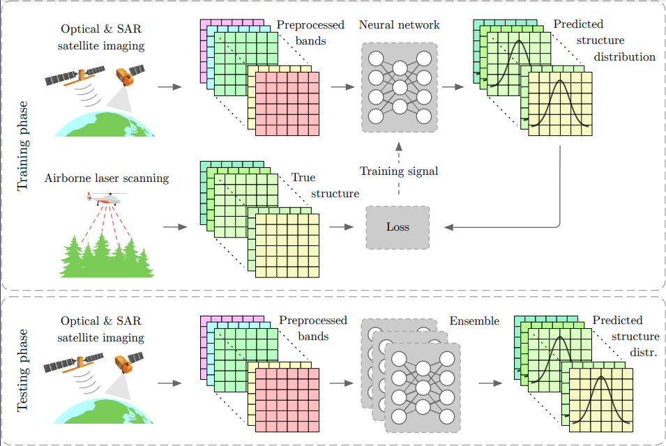

# bayes-forest-structure

Code accompanying our paper "Country-wide Retrieval of Forest Structure From Optical and SAR Satellite Imagery With Bayesian Deep Learning" [arXiv](https://arxiv.org/abs/2111.13154)



## Code organization
* `./config` configuration files for data preprocessing, training and testing
* `./src` main project code
    * `./src/scripts` helper scripts for preprocessing, evaluation etc.

## Getting started
### Prerequisites
* `python >= 3.8`
* `numpy >= 1.19`
* `pytorch >= 1.9`
* `scikit-image >= 0.18`
* `rasterio >= 1.1.5`
* `gdal >= 3.0`
* `fiona >= 1.8.13`
* `latextable`

### Inference
To apply our model to your data, preprocess the SAR data using the `/src/scripts/preprocess_s1.py` script and then reproject it to the Sentinel-2 tile. Then use `/src/scripts/predict_tile.py` to process the tile, passing the locations to the optical and SAR files as arguments. Make sure to also pass the paths of the `config.yaml` file (containing network configurations and statistics for data normalization) and of all five network checkpoints via the respective command line args. The files can be downloaded from [here](https://drive.google.com/drive/folders/1yUQOjBcbplg6I_9HmFp1vW8pdf4vOzxJ?usp=sharing). The output tiles will be written to the location passed as `--out_dir`.

### Training
For improved efficiency during training, the preprocessed and reprojected Sentinel images as well as the ground truth should be pickled first using the `/src/scripts/prepare_dataset.py` script. For training the `/src/train.py` script (along with the `/config/resnext.yaml` config file) is used.

## Citation
```
@misc{becker2021countrywide,
      title={Country-wide Retrieval of Forest Structure From Optical and SAR Satellite Imagery With Bayesian Deep Learning}, 
      author={Alexander Becker and Stefania Russo and Stefano Puliti and Nico Lang and Konrad Schindler and Jan Dirk Wegner},
      year={2021},
      eprint={2111.13154},
      archivePrefix={arXiv},
      primaryClass={cs.CV}
}
```
